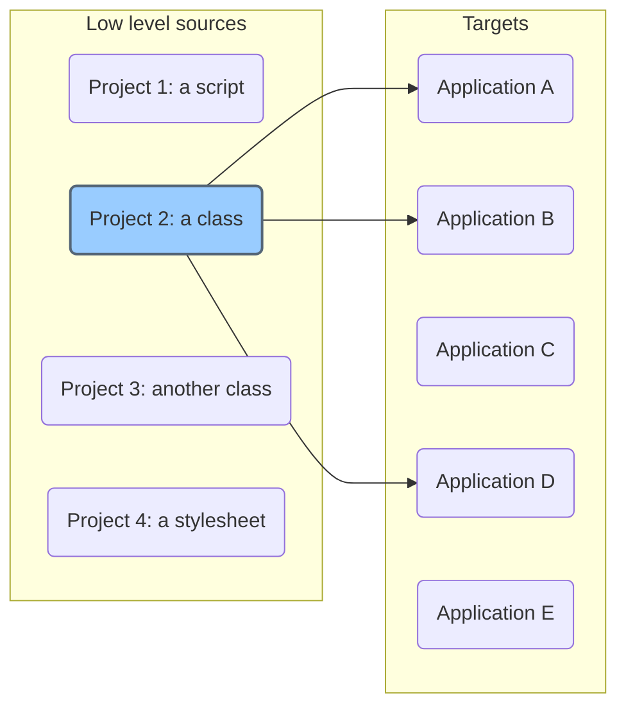
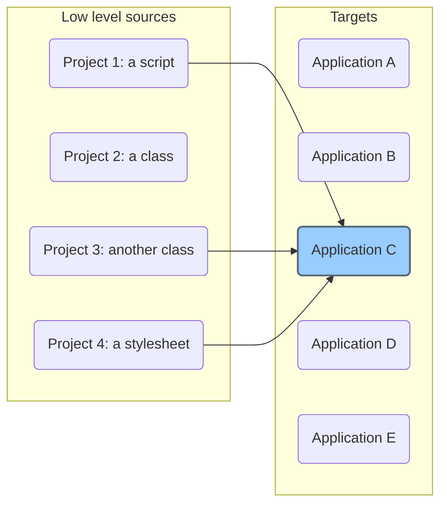

## I wrote it because ...

I had a need. I have several projects - kind of apps. The most of them use some low level files, scripts, stylesheets, classes that are located in their atomic project folders.

I wanted to have a helper that can deploy changes of an atomic but shared project to all applications that embed it.

In database language: a relation betwenn n sources and m targets.
It works in both directions.

### Usage of a source

### Sourced items in an application

DSF can copy the source files, or just compare it. 
You can list all sources with all targets to get a total overview of all elements.
There is a search for the current directory - it finds its usage in sources and targets.
