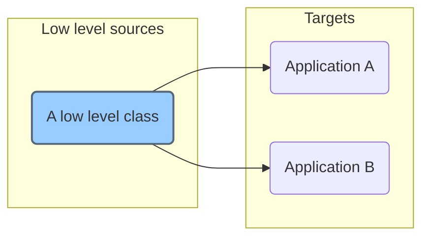

## Get help

By adding the `-h` parameter you get a help page.

```txt
> dsf -h
_______________________________________________________________________________

 ▄▄▄▄    ▄▄▄▄  ▄▄▄▄▄   |
 █   ▀▄ █▀   ▀ █       |  DEPLOY
 █    █ ▀█▄▄▄  █▄▄▄▄   |    SOURCE                                       v0.12
 █    █     ▀█ █       |      FILES  ..  to multiple local targets
 █▄▄▄▀  ▀▄▄▄█▀ █       |
 
Axel Hahns helper tool to update local files in other projects.
_______________________________________________________________________________


Copy sourcefiles to one or many targets.
It can be used to handle repository files of low level components or basic
files and update them in multiple projects.


SYNTAX:
dsf.sh [OPTIONS] [FROM] [TO]

OPTIONS:
    -c          compare source and targets; requires -s and -t
    -d [DIR]    add a directory that is below [FROM] directory
    -e          edit a profile; requires -s
    -f [FILE]   add a file that is below [FROM] directory 
                You need to set a source (see -s) before -f
    -h          show this help
    -i          interactive mode to select a source and a target
    -l          list defined sources and its targets
    -s [FROM]   set a source directory (to use -f, -t, -u)
    -S          set a source in interactive mode
    -t [TO]     set a target for a given source
                You need to set a source (see -s) before -t
    -u          update ALL known targets; [TO] is not required - targets will
                be read from config
                You need to set a source (see -s) before -u
    -w          where is .. something for the current directory?
                Search current directory for definitions in sources or targets
    -W          Like -w but it shows diffs

All projects are written as txt file wit md5 hash into "profiles" directory.
    /home/axel/skripte/deploy_shared_files/profiles
To delete a file or target grep for it in the profiles dir.

EXAMPLES:

Create/ set a source.
The target inside the current durectory will be detected and then the files
will be copied to the target.

    dsf.sh -S
                Set a source interactively and update files in autodetected 
                target.

    dsf.sh -s /home/axel/deployfiles/docs
                Set a given source source. If it does not exist yet than a new
                profile will be created interactively.

Add source files and directories
    dsf.sh -s /home/axel/deployfiles/docs -d abc
                -d = add directory
                Add a directory to the project. You get a prompt to add it if it 
                does not exist yet.

    dsf.sh -s /home/axel/deployfiles/docs -f style.css
                -f = add file
                Add a file to the project. You get a prompt to add it if it 
                does not exist yet.

    Hint: You can repeat -d and -f multiple times.

Create/ set target
    dsf.sh -s /home/axel/deployfiles/docs -t /home/projects/project_A
    OR
    dsf.sh /home/axel/deployfiles/docs /home/projects/project_A
                -t = target
                Add a targetdir to the project. You get a prompt to add it if 
                it does not exist yet.
                Then it copies all known files to the target.

Update
    dsf.sh -s /home/axel/deployfiles/docs -u
                -u = update all
                Copy all known files to all known targets.

More:
    dsf.sh -i   Interactive mode to select from known sources and targets.

    dsf.sh -l   list all known projects and show details

    dsf.sh -s /home/axel/deployfiles/docs -l
                -l = list
                list details of selected project

    dsf.sh -w   where is ... search: something for the current directory

```

## Tutorial 1

To visualize what we want to do: we define a source that is connected with 2 targets.



As an example I have this situation:

There is a baseclass project with a dummy class file.

```txt
axel@linux-pc ~/tmp> tree -A sources/
sources/
└── basesclasses
    └── sample-class.php
```

And I have 2 dummy apps with a "vendor" subdir where I want to put my sample-class.php.

```txt
axel@linux-pc ~/tmp> tree -A targets/
targets/
├── app_a
│   └── vendor
└── app_b
    └── vendor
```

### Add the source

We set/ add a source wit `-s`. You can use a full path or a relative one. Internally it will be transformed to a full path.

`dsf -s sources/basesclasses/`

```txt
========== SET SOURCE
INFO: transformed [sources/basesclasses/] --> [/home/axel/tmp/sources/basesclasses]
Add [/home/axel/tmp/sources/basesclasses] as new source? Yn >
INFO: adding new source...
INFO: config file was rewritten.
INFO: SOURCE=/home/axel/tmp/sources/basesclasses was set.
```

### Add a source file

The source is just a base folder. We can define a single file that should be deployed to a target `-f` or a subdirectory using `-d` (it will be deployed recursively).

To add a file we must add the source and set the file to add

`dsf -s sources/basesclasses/ -f sources/basesclasses/sample-class.php`

In the output you will be asked again to add a new file

```txt
========== SET SOURCE
INFO: transformed [sources/basesclasses/] --> [/home/axel/tmp/sources/basesclasses]
INFO: SOURCE=/home/axel/tmp/sources/basesclasses was set.

----- Add file [sources/basesclasses/sample-class.php]
INFO: file was found [/home/axel/tmp/sources/basesclasses//sample-class.php]
Add file [/sample-class.php] for rollout? Yn >
INFO: adding new file
INFO: config file was rewritten.
```

### Add a target 1

To add a target you need to specify the source first and then you can add the target.

`dsf -s sources/basesclasses/ -t targets/app_a/vendor/`

If the target does not exist yet then will be prompted. If you accept (just press `Return`) then the target will be added and the file will be synced there.

```txt
========== SET SOURCE
INFO: transformed [sources/basesclasses/] --> [/home/axel/tmp/sources/basesclasses]
INFO: SOURCE=/home/axel/tmp/sources/basesclasses was set.

========== SET TARGET targets/app_a/vendor/
INFO: transformed [targets/app_a/vendor/] --> [/home/axel/tmp/targets/app_a/vendor]
Add [/home/axel/tmp/targets/app_a/vendor] as new target? Yn >
INFO: adding new target 
INFO: config file was rewritten.

----- Updating /home/axel/tmp/targets/app_a/vendor//sample-class.php
rsync ... OK
```

### Add a target 2

Oh, this is a no brainer. It is the same procedure like for app_a:

`dsf -s sources/basesclasses/ -t targets/app_b/vendor/`

### List config

OK, we just added a single config. But if you have multiple sources you can limit the output to a single source by using `-s`.

Without -s you cal list all sources with its targets by using `-l`:

`dsf -l`

... and you will get somethingh like that:

```txt
========== LIST PROFILES

/home/axel/tmp/sources/basesclasses
  |
  +-- INFO: no directory was added so far.
  |
  +-- files (1):
  |     |
  |     +-- /sample-class.php
  |
  +-- targets (2):
        |
        +-- /home/axel/tmp/targets/app_a/vendor
        +-- /home/axel/tmp/targets/app_b/vendor
```

### Search usage of current dir

If you are in one of the existing source or target folders you can use `-w` (for **w**here is something for me?) to find all targets (if you are in a source directory) or all sources if you are in a target directory.

```txt
axel@linux-pc ~/tmp> cd sources/
```

And now let's try `dsf -w`:

```txt
========== Where is something for me?

scanning for /home/axel/tmp/sources ...

--- scan in sources

> SOURCE /home/axel/tmp/sources/basesclasses

--- scan in targets
```

And now the opposite direction:

```txt
axel@linux-pc ~/tmp> cd ../targets
```
Let's call `dsf -w` again:

```txt
========== Where is something for me?

scanning for /home/axel/tmp/targets ...

--- scan in sources

--- scan in targets

> SOURCE /home/axel/tmp/sources/basesclasses
  > TARGET /home/axel/tmp/targets/app_a/vendor

> SOURCE /home/axel/tmp/sources/basesclasses
  > TARGET /home/axel/tmp/targets/app_b/vendor
```

### Update base files in your app

In your app you can update the default files of a given base source. Change the directory to your app.

```txt
cd ~/tmp/targets/app_a/
```

With `dsf -S` you get a list of all sources and can select from it.

After selecting a source its targets will be scanned to find a matching folder in the current working directory.

### Update all targets

We have seen if we use `-s SOURCE -t TARGET` that the source will be synced to a single target.
To sync to all targets there is a special keyword `-t ALL`. 

```txt
========== SET SOURCE
INFO: transformed [sources/basesclasses/] --> [/home/axel/tmp/sources/basesclasses]
INFO: SOURCE=/home/axel/tmp/sources/basesclasses was set.

========== SET TARGET ALL

========== SET TARGET /home/axel/tmp/targets/app_a/vendor

----- Updating /home/axel/tmp/targets/app_a/vendor//sample-class.php
rsync ... OK

========== SET TARGET /home/axel/tmp/targets/app_b/vendor

----- Updating /home/axel/tmp/targets/app_b/vendor//sample-class.php
rsync ... OK
```